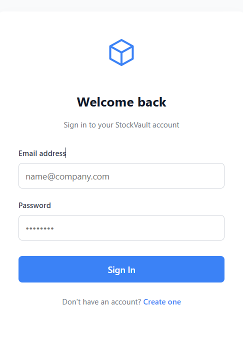
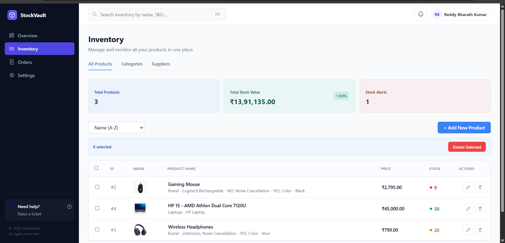
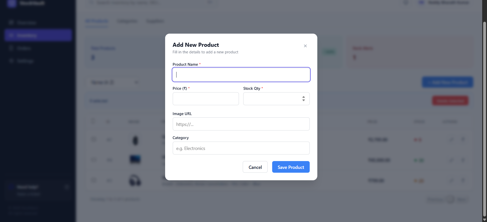
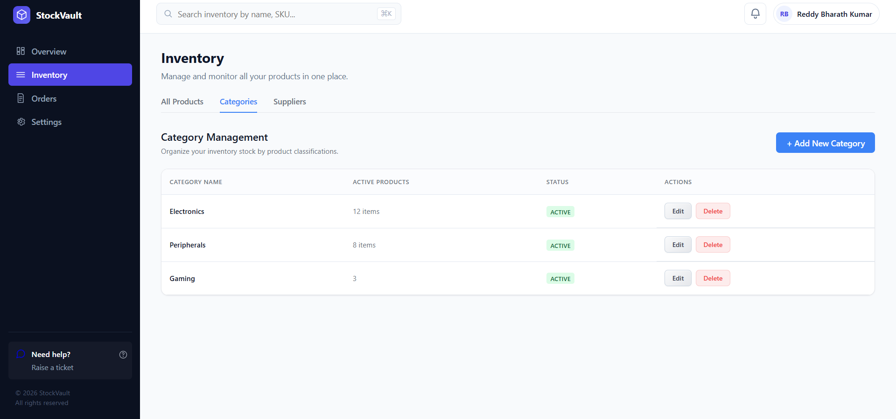
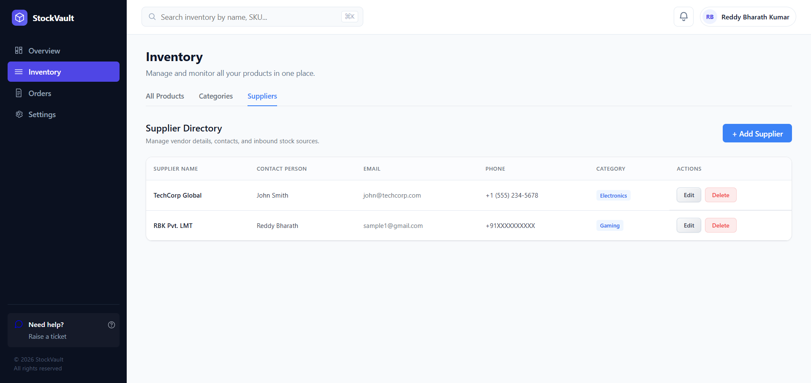
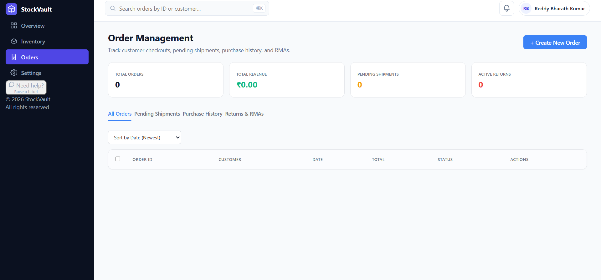

# 📦 StockVault

> **Enterprise-Grade Inventory & Order Management Dashboard**

A high-performance, zero-dependency web application engineered for real-time inventory tracking, multi-tier order management, and seamless client-side state persistence. Built entirely with modern vanilla web technologies to eliminate framework bloat and maximize execution speed.

---

## 🚀 Tech Stack & Architecture

StockVault relies on native browser APIs and modular DOM architecture rather than heavy external frameworks:

* **Core Language:** JavaScript (ES6+) / Vanilla JS
* **Markup & Styling:** HTML5, CSS3 (Responsive Design)
* **Data Management & State:** Browser `localStorage` (Client-Side Serialization)
* **Architecture Pattern:** Modular Multi-Page Architecture with Dynamic DOM Injection
* **Version Control & Tools:** Git, GitHub, VS Code, IntelliJ IDEA, Postman

---

## ✨ Core Features & Engineering Highlights

* **Modular Multi-Page Architecture:** Built with clean routing and separation of concerns across core views (Overview, Inventory, Orders, and Settings).
* **Centralized Layout Engine (`shell.js`):** Implemented dynamic DOM injection to enforce the DRY (Don't Repeat Yourself) principle, decoupling global navigation and structural markup.
* **Visibility-Driven Global Search:** Developed a responsive search utility that evaluates computed layout styles (`window.getComputedStyle`) to query active DOM nodes dynamically without memory leaks.
* **Resilient State Persistence:** Engineered complete order management CRUD (Create, Read, Update, Delete) operations backed by browser `localStorage` serialization and real-time metric calculations.

---

## 🖥️ Visual Demo & UI Walkthrough

---

<table>
  <tr>
    <td width="45%" align="center">
      
    </td>
    <td width="55%" valign="top">
      
      <p><strong>💡 What We Offer Here:</strong></p>
      <p>A secure entry-point interface that authenticates users before initializing the dashboard environment, preventing unauthorized entry.</p>
    </td>
  </tr>
</table>

---

<table>
  <tr>
    <td width="45%">
      
    </td>
    <td width="55%" valign="top">
      
      <p><strong>💡 What We Offer Here:</strong></p>
      <p>A centralized command center tracking live stock valuations, automated stock alerts, and multi-parameter sorting to manage physical assets instantly.</p>
    </td>
  </tr>
</table>

---

<table>
  <tr>
    <td width="45%">
      
    </td>
    <td width="55%" valign="top">
      
      <p><strong>💡 What We Offer Here:</strong></p>
      <p>Dynamic modal forms supporting full CRUD operations, built-in input validations, and image URL bindings for seamless product creation.</p>
    </td>
  </tr>
</table>

---

<table>
  <tr>
    <td width="45%">
      
    </td>
    <td width="55%" valign="top">
      
      <p><strong>💡 What We Offer Here:</strong></p>
      <p>A structured product taxonomy view that tracks active product volumes per classification to keep inventory logically segmented.</p>
    </td>
  </tr>
</table>

---

<table>
  <tr>
    <td width="45%">
      
    </td>
    <td width="55%" valign="top">
      
      <p><strong>💡 What We Offer Here:</strong></p>
      <p>A dedicated vendor management module mapping contact persons, business communications, and inbound stock sources.</p>
    </td>
  </tr>
</table>

---

<table>
  <tr>
    <td width="45%">
      
    </td>
    <td width="55%" valign="top">
      
      <p><strong>💡 What We Offer Here:</strong></p>
      <p>A multi-tier order tracking system monitoring gross revenue, pending shipments, active returns, and real-time transaction workflows.</p>
    </td>
  </tr>
</table>

## 📂 Project Structure

```text
StockVault/
│
├── index.html          # Main authentication & entry point
├── overview.html       # Overview analytics & metrics dashboard
├── inventory.html      # Inventory tracking, categories & supplier management view
├── orders.html         # Order lifecycle & transaction fulfillment view
├── accounts.html       # User profile and account management view
├── billing.html        # Financial records and billing statements view
├── settings.html       # System configuration & preferences view
├── css/
│   └── styles.css      # Enterprise-grade responsive stylesheet
├── js/
│   ├── shell.js        # Centralized layout engine & dynamic DOM injection
│   └── storage.js      # LocalStorage serialization & CRUD management
└── [image assets]      # UI walkthrough screenshots (.png files)
